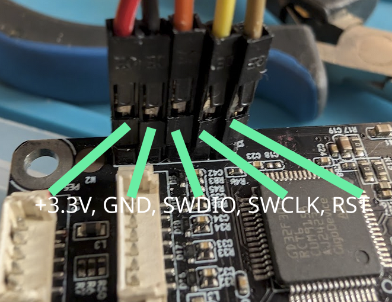

# ACEPRO Katapult Bootloader — OTA Installer

> **⚠️ WARNING — READ BEFORE PROCEEDING**
>
> This tool **permanently replaces** the stock bootloader on your Anycubic ACE
> Pro. It is a **one-way, irreversible operation** without an SWD debugger.
> If something goes wrong (power loss, USB disconnect, wrong firmware), your
> ACE Pro **will be bricked** and can only be recovered with SWD hardware.
>
> The authors of this repository accept **no responsibility** for damaged,
> bricked, or non-functional devices. You use this entirely **at your own risk**.
>
> **If you do not know what Katapult, Klipper, or a bootloader is — this
> repository is not intended for you. Do not proceed.**

---

## Contents

- [Hardware](#hardware)
- [How It Works](#how-it-works)
- [Prerequisites](#prerequisites)
- [Back Up Your Flash First (Optional)](#back-up-your-flash-first-optional)
- [Quick Start (Pre-Built)](#quick-start-pre-built)
- [Building From Source](#building-from-source)
- [Flashing Klipper](#flashing-klipper)
- [Updating Klipper Later](#updating-klipper-later)
- [Switching to Stock ACE Firmware](#switching-to-stock-ace-firmware)
- [Cheat Sheet](#cheat-sheet)
- [Warning](#warning)
- [File Overview](#file-overview)
- [Memory Map](#memory-map)
- [Credits](#credits)

---

Install the [Katapult](https://github.com/Arksine/katapult) bootloader on an
**Anycubic Color Engine Pro (ACE Pro)** — no SWD debugger required.

Uses the stock firmware's USB OTA mechanism to deliver a small "shim" that
replaces the stock bootloader with Katapult. Once Katapult is installed you
can flash [Klipper](https://github.com/Klipper3d/klipper) **or the stock ACE
firmware** over USB without opening the device. Katapult uses a 32 KiB offset
(`0x08008000`) — the same base address as the stock ACE app — enabling
software-only switching between Klipper and patched stock firmware.

**Just want to flash?** Jump to the [Cheat Sheet](#cheat-sheet) for
copy-paste commands using the pre-built binaries from this repo.
The rest of this document covers the full build-from-source process,
firmware patching, and technical details.

## Hardware

| Item | Value |
|------|-------|
| MCU | GD32F303CCT6 (STM32F103 compatible) |
| Flash | 256 KiB |
| RAM | 48 KiB |
| USB | Full-Speed USB-FS, PB9 external D+ pullup |

## How It Works

### Initial Katapult Installation

```
Stock ACE firmware (running)
  │
  ├─ OTA pushes shim.bin → staging area (0x08024000)
  │
  ▼
Stock bootloader copies shim → app area (0x08008000), reboots
  │
  ▼
Shim runs: erases 0x08000000, writes embedded Katapult, resets
  │
  ▼
Katapult bootloader running at 0x08000000  ← done
  │
  ▼
Flash Klipper or patched stock ACE at 0x08008000 via flash_can.py
```

### Dual-Boot: Switching Between Klipper and Stock ACE

Once Katapult is installed, you can switch freely between Klipper and the
patched stock ACE firmware — no SWD debugger needed:

```
Klipper (running at 0x08008000)
  │  flash_can.py -r  → enter Katapult
  ▼
Katapult (waiting at 0x08000000)
  │  flash_can.py -f ACE_patched.bin
  ▼
Stock ACE (running at 0x08008000, patched for Katapult re-entry)
  │  enter_katapult.py  → sends iap_upgrade JSON-RPC → reboot to Katapult
  ▼
Katapult (waiting at 0x08000000)
  │  flash_can.py -f klipper.bin
  ▼
Klipper (running again)
```

## Prerequisites

- **ACE Pro with stock firmware** — must respond on USB as `ANYCUBIC ACE`
- **Python 3.8+** with `pyserial`:
  ```bash
  sudo apt install python3-serial   # Debian/Ubuntu
  # or: pip install --user pyserial
  ```
- **ARM GCC toolchain** (only needed if building from source or using Black Magic Probe):
  ```bash
  # Ubuntu/Debian — includes arm-none-eabi-gdb and arm-none-eabi-objcopy
  sudo apt install gcc-arm-none-eabi binutils-arm-none-eabi
  # Fedora
  sudo dnf install arm-none-eabi-gcc-cs arm-none-eabi-newlib arm-none-eabi-binutils-cs
  ```

## Back Up Your Flash First (Optional)

> This requires **disassembling the ACE Pro enclosure** to access the mainboard
> and **soldering a pin header** to the unpopulated SWD pads. Only relevant if
> you own an SWD debugger (ST-Link v2, Black Magic Probe, J-Link, etc.).

SWD wiring reference for **ST-Link v2** or **Black Magic Probe**:



If you have an SWD debugger, **dump the entire flash before doing anything**.
The GD32F303 remaps SWD pins at startup — NRST must be held low during
connect. The Black Magic Probe handles this automatically via
`monitor connect_rst enable` (direct GPIO control of NRST).

**Black Magic Probe (recommended):**
```bash
arm-none-eabi-gdb -batch \
  -ex "target extended-remote /dev/serial/by-id/usb-Black_Magic_Debug_*-if00" \
  -ex "monitor connect_rst enable" \
  -ex "monitor swd_scan" \
  -ex "attach 1" \
  -ex "dump binary memory ace_full_256k.bin 0x08000000 0x08040000" \
  -ex "detach"
```

This gives you a full 256 KiB image (`ace_full_256k.bin`) — stock bootloader +
app + OTA staging area. With this backup you can always recover via SWD.

**Restore a full backup via Black Magic Probe:**
```bash
# Convert raw .bin to ELF (GDB 'load' requires ELF, not raw binary)
arm-none-eabi-objcopy -I binary -O elf32-littlearm \
  --change-section-address .data=0x08000000 \
  ace_full_256k.bin ace_full_256k.elf

# Flash via BMP
arm-none-eabi-gdb -batch \
  -ex "target extended-remote /dev/serial/by-id/usb-Black_Magic_Debug_*-if00" \
  -ex "monitor connect_rst enable" \
  -ex "monitor swd_scan" \
  -ex "attach 1" \
  -ex "load ace_full_256k.elf" \
  -ex "compare-sections" \
  -ex "detach"
```

## Quick Start (Pre-Built)

A pre-built `shim.bin` is included for convenience. If you trust it:

> **Note:** Serial ports require permissions. Either use `sudo` or add your
> user to the `dialout` group: `sudo usermod -aG dialout $USER` (log out/in
> to take effect).

```bash
# 1. Find your ACE serial port
ls /dev/serial/by-id/ | grep -i ace
# Example: usb-ANYCUBIC_ACE_1-if00

# 2. Install Katapult (replaces stock bootloader — irreversible without SWD)
sudo python3 ota_install_katapult.py --port /dev/serial/by-id/usb-ANYCUBIC_ACE_1-if00

# 3. Wait ~10 seconds, then verify Katapult is running
lsusb | grep 1d50:6177
```

Expected `dmesg` output during the install process (bus/device numbers will vary):

```
# Stock ACE firmware (initial state)
usb 5-3.1.2: New USB device found, idVendor=28e9, idProduct=018a, bcdDevice= 1.00
usb 5-3.1.2: Product: ACE
usb 5-3.1.2: Manufacturer: ANYCUBIC
usb 5-3.1.2: SerialNumber: 1
cdc_acm 5-3.1.2:1.0: ttyACM2: USB ACM device

# After OTA push — stock bootloader copies shim, device re-enumerates briefly
usb 5-3.1.2: USB disconnect, device number 69
usb 5-3.1.2: new full-speed USB device number 70 using xhci_hcd
usb 5-3.1.2: New USB device found, idVendor=28e9, idProduct=018a, bcdDevice= 1.00
usb 5-3.1.2: Product: ACE
usb 5-3.1.2: Manufacturer: ANYCUBIC
cdc_acm 5-3.1.2:1.0: ttyACM2: USB ACM device

# Shim runs — erases stock bootloader, writes Katapult, resets
usb 5-3.1.2: USB disconnect, device number 70

# ✓ Katapult bootloader is now running (1d50:6177)
usb 5-3.1.2: new full-speed USB device number 71 using xhci_hcd
usb 5-3.1.2: New USB device found, idVendor=1d50, idProduct=6177, bcdDevice= 1.00
usb 5-3.1.2: Product: stm32f103xe
usb 5-3.1.2: Manufacturer: katapult
usb 5-3.1.2: SerialNumber: 2BCF7AC5A461301239313538
cdc_acm 5-3.1.2:1.0: ttyACM2: USB ACM device
```

## Building From Source

If you want to build the shim yourself (as the source is the only truth):

### 1. Build Katapult

```bash
git clone https://github.com/Arksine/katapult.git
cd katapult
git apply ../ACEPRO-katapult-bootloader/katapult-ace-gd32f303.patch
make menuconfig
```

> **🚨⚠️🚨 CRITICAL — Set these exact values in menuconfig. 🚨⚠️🚨**
> A wrong selection will build Katapult for the wrong MCU and **brick your
> device**. The build will abort if the MSP check fails, but double-check
> before flashing.

| Setting | Value |
|---------|-------|
| Micro-controller Architecture | **STM32** |
| Processor model | **STM32F103** |
| Flash/RAM variant (Low Level) | **256KiB Flash / 48KiB RAM** |
| USB interface | **USB on PA11/PA12** |
| Application start offset | **32KiB offset** |
| Enable double-reset bootloader entry | **yes** (500ms) |

```bash
make -j$(nproc)
# Result: out/katapult.bin (should be ~4 KiB)
```

### 2. Build the Shim

```bash
cd /path/to/ACEPRO-katapult-bootloader

# Default: expects ../katapult/out/katapult.bin
make

# Or specify the path:
make KATAPULT_BIN=/path/to/katapult.bin

# If arm-none-eabi-gcc is not in PATH:
make CROSS_PREFIX=/path/to/arm-none-eabi-
```

Output: `shim.bin` (~5 KiB)

> **Safety checks:** Two layers protect against flashing a wrong-MCU Katapult
> binary:
> 1. **Build-time** — the Makefile validates that the first 4 bytes of
>    `katapult.bin` (the initial MSP) point to GD32F303 SRAM (`0x2000xxxx`).
>    The build aborts with an error if they don't.
> 2. **Runtime** — `shim.c` checks the embedded Katapult MSP before erasing
>    flash. If the MSP is outside `0x2000xxxx`, the shim hangs harmlessly
>    instead of bricking the device.

### 3. Flash

```bash
sudo python3 ota_install_katapult.py --port /dev/serial/by-id/usb-ANYCUBIC_ACE_1-if00
```

The script will:
1. Connect to the ACE and show firmware version
2. Ask for confirmation (type `YES`)
3. Push shim.bin via the stock OTA protocol
4. The device reboots twice automatically (~10 seconds total)

### 4. Verify

```bash
lsusb | grep 1d50:6177
# Expected: OpenMoko, Inc. stm32f103xe

ls /dev/serial/by-id/ | grep katapult
# Expected: usb-katapult_stm32f103xe_...-if00
```

## Flashing Klipper

Once Katapult is installed, flash Klipper:

```bash
# 1. Clone and patch Klipper
git clone https://github.com/Klipper3d/klipper.git
cd klipper
git apply /path/to/klipper-ace-gd32f303.patch

# 2. Configure: STM32F103, 256KiB/48KiB, USB, 32KiB bootloader offset
make menuconfig
make -j$(nproc)

# 3. Flash via Katapult
sudo python3 /path/to/katapult/scripts/flash_can.py \
  -d /dev/serial/by-id/usb-katapult_stm32f103xe_*-if00 \
  -f out/klipper.bin

# 4. Verify
ls /dev/serial/by-id/ | grep klipper
# Expected: usb-Klipper_stm32f103xe_...-if00
```

Expected `dmesg` output when flashing Klipper via Katapult:

```
# Katapult bootloader waiting (1d50:6177)
usb 5-3.1.2: New USB device found, idVendor=1d50, idProduct=6177, bcdDevice= 1.00
usb 5-3.1.2: Product: stm32f103xe
usb 5-3.1.2: Manufacturer: katapult
usb 5-3.1.2: SerialNumber: 2BCF7AC5A461301239313538
cdc_acm 5-3.1.2:1.0: ttyACM2: USB ACM device

# flash_can.py flashes Klipper, device resets
usb 5-3.1.2: USB disconnect, device number 70

# ✓ Klipper is now running (1d50:614e)
usb 5-3.1.2: new full-speed USB device number 71 using xhci_hcd
usb 5-3.1.2: New USB device found, idVendor=1d50, idProduct=614e, bcdDevice= 1.00
usb 5-3.1.2: Product: stm32f103xe
usb 5-3.1.2: Manufacturer: Klipper
usb 5-3.1.2: SerialNumber: 2BCF7AC5A461301239313538
cdc_acm 5-3.1.2:1.0: ttyACM2: USB ACM device
```

## Updating Klipper Later

Katapult stays permanently in the first 32 KiB. To re-flash Klipper in the
future, enter the bootloader and flash again:

```bash
# From a running Klipper, request bootloader mode:
sudo python3 /path/to/katapult/scripts/flash_can.py \
  -d /dev/serial/by-id/usb-Klipper_stm32f103xe_*-if00 \
  -r

# Then flash:
sudo python3 /path/to/katapult/scripts/flash_can.py \
  -d /dev/serial/by-id/usb-katapult_stm32f103xe_*-if00 \
  -f klipper/out/klipper.bin
```

## Switching to Stock ACE Firmware

You can flash the stock ACE firmware back via Katapult at any time. The stock
firmware must first be **patched** so it can re-enter Katapult later (otherwise
you'd be stuck on stock with no way back without SWD).

### 1. Obtain the Stock ACE Firmware

The stock firmware is distributed by Anycubic as `.swu` files. These are
**password-protected ZIP** archives containing a `setup.tar.gz` with the raw
MCU binary inside.

Downloads (hosted by the [Rinkhals](https://github.com/jbatonnet/Rinkhals) project):

| Version | URL |
|---------|-----|
| V1.3.863 | https://drive.google.com/file/d/1WwSRlEp_iudO2CpcRVHwhFUiVPLMVoIp/view?usp=sharing |
| V1.3.84 | https://rinkhals.thedju.net/Other/ACE_1.3.84.swu |
| V1.3.76 | https://rinkhals.thedju.net/Other/ACE_1.3.76.swu |

ZIP password: `U2FsdGVkX19deTfqpXHZnB5GeyQ/dtlbHjkUnwgCi+w=`

Extract the firmware binary:

```bash
# Download
curl -L -o ACE_1.3.84.swu 'https://rinkhals.thedju.net/Other/ACE_1.3.84.swu'

# Extract (password-protected ZIP → tar.gz → .bin)
unzip -P 'U2FsdGVkX19deTfqpXHZnB5GeyQ/dtlbHjkUnwgCi+w=' ACE_1.3.84.swu
tar xzf update_swu/setup.tar.gz

# Result: ACE_V1.3.84_20240929.bin (105184 bytes)
```

Verify the SHA-256 checksum:

| File | SHA-256 |
|------|---------|
| `ACE_V1.3.863_20250518.bin` | `3f3676ba357749b3d0367922cb7f6b0dedc9b3d104c1c29e719ac3e563f5eb63` |
| `ACE_V1.3.84_20240929.bin` | `36c3986fdc9d3e4e304ad281152c1ee794e49c2d421534f04b037affd02a8efd` |
| `ACE_V1.3.76_20240703.bin` | `e02cce88910083555d2d8f97a89daa1da336ddfb760c12295017085e7f6603d2` |

### 2. Patch the Stock Firmware

```bash
# Patches ota_set_upgrade_params() to reboot into Katapult on iap_upgrade
python3 patch_ace_katapult.py ACE_V1.3.84_20240929.bin
# Output: ACE_V1.3.84_20240929_katapult.bin
```

The patcher finds the `ota_set_upgrade_params()` function via a unique Thumb-2
prologue signature and replaces its first 48 bytes with position-independent
code that writes the Katapult REQUEST_CANBOOT magic (`0x5984E3FA6CA1589B`) to
`0x2000BFF8` and triggers a system reset. This is safe — the OTA function is
never used once Katapult replaces the stock bootloader.

<details>
<summary>Signature details (for manual patching if the heuristic fails)</summary>

The patcher searches for this 24-byte Thumb-2 prologue (one wildcard byte
marked `XX` for the PC-relative LDR offset):

```
2d e9 f0 41  04 46 0d 46  16 46 1f 46  XX 48  00 7e  10 b1  00 20  bd e8 f0 81
```

Disassembled (from V1.3.84 at file offset `0x1E30`, address `0x08009E30`):

```asm
; ota_set_upgrade_params(uint8_t *fw_data, uint16_t len, uint8_t *md5, uint32_t fw_size)
; Early-return path: if already upgrading, return 0.
                                        ;
  08009E30:  e92d 41f0   PUSH   {r4-r8, lr}       ; ← signature starts here
  08009E34:  4604        MOV    r4, r0
  08009E36:  460d        MOV    r5, r1
  08009E38:  4616        MOV    r6, r2
  08009E3A:  461f        MOV    r7, r3
  08009E3C:  4809        LDR    r0, [pc, #36]      ; → &ota_state struct
  08009E3E:  7e00        LDRB   r0, [r0, #0x18]    ; ota_state.upgrading flag
  08009E40:  b110        CBZ    r0, continue        ; if not upgrading, continue
  08009E42:  2000        MOVS   r0, #0              ; return false
  08009E44:  e8bd 81f0   POP    {r4-r8, pc}         ; ← signature ends here (24 bytes)
continue:
  08009E48:  ...         (stores params into ota_state struct, calls memcpy, etc.)
```

The first 48 bytes (from PUSH through the first few instructions after CBZ)
are replaced with this position-independent reboot payload:

```asm
; Reboot-to-Katapult payload (48 bytes)
; Writes REQUEST_CANBOOT magic to 0x2000BFF8 and triggers SYSRESETREQ.
                                        ;
  LDR    r0, =0x2000BFF8               ; &_stack_end (Katapult magic address)
  LDR    r1, =0x6CA1589B               ; magic low word
  LDR    r2, =0x5984E3FA               ; magic high word
  STR    r1, [r0, #0]                  ; store magic low
  STR    r2, [r0, #4]                  ; store magic high
  DSB    SY                            ; data synchronisation barrier
  LDR    r0, =0xE000ED0C               ; &AIRCR (Application Interrupt Reset Control)
  LDR    r1, =0x05FA0004               ; VECTKEY | SYSRESETREQ
  STR    r1, [r0, #0]                  ; trigger system reset
  DSB    SY
  B      .                             ; loop until reset takes effect
  ; --- literal pool ---
  .word  0x2000BFF8                    ; magic address
  .word  0x6CA1589B                    ; magic low
  .word  0x5984E3FA                    ; magic high
  .word  0xE000ED0C                    ; AIRCR
  .word  0x05FA0004                    ; VECTKEY | SYSRESETREQ
```

**Payload hex (48 bytes):**
```
0648 0749 074a 0160 4260 bff34f8f 0648 0649 0160 bff34f8f fee7 0000
f8bf0020 9b58a16c fae38459 0ced00e0 0400fa05
```

If the heuristic fails on a future firmware version, you can manually find
`ota_set_upgrade_params()` by searching for the `iap_upgrade` string reference
and tracing the JSON-RPC handler that calls it. Then overwrite the first 48
bytes of that function with the payload hex above.

</details>

### 3. Flash Patched Stock Firmware

```bash
# Enter Katapult from running Klipper
sudo python3 /path/to/katapult/scripts/flash_can.py \
  -d /dev/serial/by-id/usb-Klipper_stm32f103xe_*-if00 \
  -r

# Flash the patched ACE firmware
sudo python3 /path/to/katapult/scripts/flash_can.py \
  -d /dev/serial/by-id/usb-katapult_stm32f103xe_*-if00 \
  -f ACE_V1.3.84_20240929_katapult.bin
```

The ACE Pro will now boot the stock ACE firmware and appear as
`usb-ANYCUBIC_ACE_1-if00`.

### 4. Re-enter Katapult from Stock ACE

```bash
sudo python3 enter_katapult.py
# or: sudo python3 enter_katapult.py --port /dev/serial/by-id/usb-ANYCUBIC_ACE_1-if00
```

This sends the `iap_upgrade` JSON-RPC command, which triggers the patched
`ota_set_upgrade_params()` reboot-to-Katapult code. The device reboots into
Katapult (`1d50:6177`) and you can flash Klipper again.

## Cheat Sheet

Copy-paste commands from the repo root. Only dependency: clone Katapult once
for `flash_can.py` (no build needed):

```bash
sudo apt install python3-serial            # Debian/Ubuntu
git clone https://github.com/Arksine/katapult.git /tmp/katapult 2>/dev/null || true
```

**Install Katapult (first time, from stock ACE — irreversible without SWD):**
```bash
sudo python3 ota_install_katapult.py --port /dev/serial/by-id/usb-ANYCUBIC_ACE_1-if00
```

**Flash Klipper (Katapult already running):**
```bash
sudo python3 /tmp/katapult/scripts/flash_can.py \
  -d /dev/serial/by-id/usb-katapult_stm32f103xe_*-if00 \
  -f /path/to/klipper.bin
```

**Klipper → Katapult → flash something else:**
```bash
sudo python3 /tmp/katapult/scripts/flash_can.py \
  -d /dev/serial/by-id/usb-Klipper_stm32f103xe_*-if00 -r
sleep 3
sudo python3 /tmp/katapult/scripts/flash_can.py \
  -d /dev/serial/by-id/usb-katapult_stm32f103xe_*-if00 \
  -f /path/to/firmware.bin
```

**Stock ACE (patched) → Katapult → flash something else:**
```bash
sudo python3 enter_katapult.py --port /dev/serial/by-id/usb-ANYCUBIC_ACE_1-if00
sleep 3
sudo python3 /tmp/katapult/scripts/flash_can.py \
  -d /dev/serial/by-id/usb-katapult_stm32f103xe_*-if00 \
  -f /path/to/firmware.bin
```

**Verify what's running:**
```bash
ls /dev/serial/by-id/ | grep -E '(ANYCUBIC|Klipper|katapult)'
```

## Warning

> **Installing Katapult is a one-way operation without SWD.** Once the shim
> runs, the stock bootloader is gone. If power is lost during the ~200 ms
> flash write, the device will be bricked and require SWD recovery.
>
> After Katapult is installed, you can switch freely between Klipper and
> patched stock ACE firmware — but you cannot restore the original stock
> bootloader without an SWD debugger.
>
> **Back up your flash** before proceeding if you have an SWD debugger.

## File Overview

| File | Description |
|------|-------------|
| `shim.c` | Shim firmware source — erases stock BL, writes embedded Katapult |
| `shim.ld` | Linker script (base `0x08008000`, runs from stock app area) |
| `katapult_payload.S` | Assembly wrapper that embeds `katapult.bin` via `.incbin` |
| `Makefile` | Build pipeline |
| `ota_install_katapult.py` | Host-side installer script (initial Katapult installation via stock OTA) |
| `ace_ota.py` | ACE OTA protocol library (USB CDC JSON-RPC + binary chunks) |
| `shim.bin` | Pre-built shim binary (includes Katapult v0.0.1) |
| `katapult.bin` | Pre-built Katapult binary for GD32F303 (embedded in `shim.bin`) |
| `katapult-ace-gd32f303.patch` | Patch for upstream Katapult — GD32F303 config, 32KiB offset, PB9 USB fix |
| `patch_ace_katapult.py` | Patches stock ACE firmware to reboot into Katapult on `iap_upgrade` |
| `enter_katapult.py` | Sends `iap_upgrade` to patched ACE firmware to re-enter Katapult |
| `swd.png` | SWD wiring reference photo for ST-Link v2 / Black Magic Probe |

## Memory Map

```
0x08000000 ┌──────────────────────┐
           │ Katapult (32 KiB)    │  ← installed by shim (actual size ~4 KiB,
           │                      │     reserves 32 KiB for app alignment)
0x08008000 ├──────────────────────┤
           │ Klipper (~40 KiB)    │  ← flashed via Katapult
           │   — or —             │
           │ Stock ACE (~103 KiB) │  ← flashed via Katapult (patched)
           │                      │
0x08040000 └──────────────────────┘
           256 KiB total flash
```

The 32 KiB offset is chosen so that both Klipper and the stock ACE firmware
share the same base address (`0x08008000`), enabling dual-boot via Katapult.

## Credits

- [Katapult](https://github.com/Arksine/katapult) by Arksine
- [Klipper](https://github.com/Klipper3d/klipper)

## License

GPL-3.0 — see Katapult and Klipper licenses.
